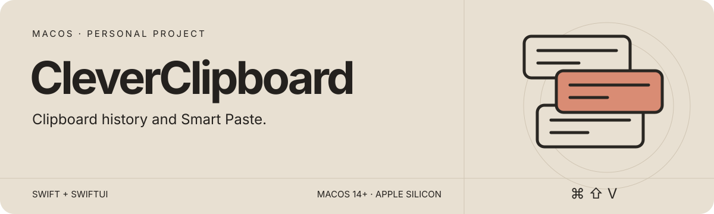
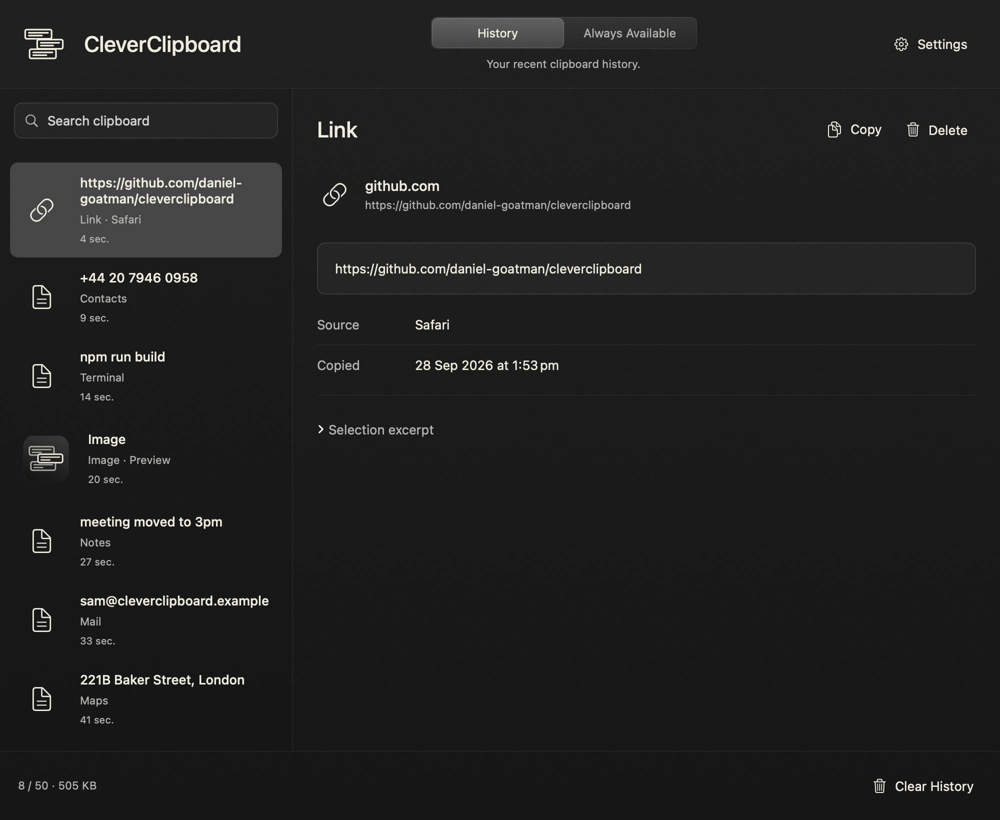
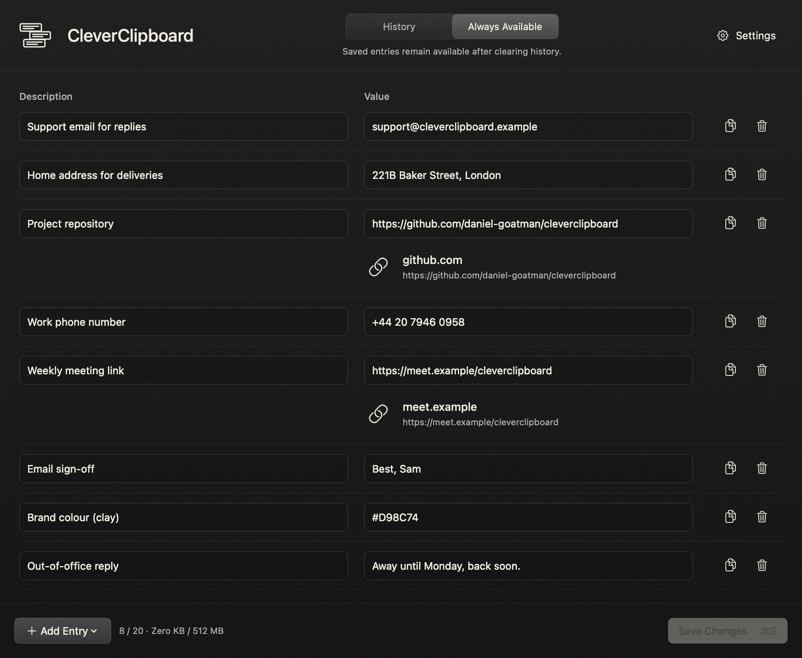

<p align="center">
  
</p>

<p align="center">
  <a href="#smart-paste">How it works</a> ·
  <a href="#set-up-with-an-agent">Agent setup prompt</a> ·
  <a href="#manual-setup">Manual setup</a> ·
  <a href="docs/GUIDE.md">Full guide</a>
</p>

## Smart Paste

CleverClipboard uses **TypeSafe’s Jev** to choose what to paste from your clipboard history and saved entries. It runs in the macOS menu bar; **⌘⇧V** triggers selection and **⌘V** keeps its normal behaviour.

When you press **⌘⇧V**:

1. The app reads the destination through Accessibility: the focused field, nearby text, and insertion context where available. Optional local OCR supplements missing context.
2. It sends that context and eligible clipboard candidates to Jev, including saved-entry descriptions, source app, and recency.
3. Jev selects an existing item. The app checks that the destination and clipboard haven't changed, then pastes it. It doesn't generate or rewrite the content.

A valid no-match response or confidence of 70% or less falls back to the latest clipboard item. Network errors and invalid responses paste nothing. See the [context contract](CONTEXT_CONTRACT.md) for the request boundaries and capture limitations.

## Set up with an agent

Copy this into Codex, Claude Code, or another coding agent running on your Mac:

```text
Set up and run https://github.com/Daniel-Goatman/CleverClipboard on this Mac.

Clone the repository, or use the existing checkout if one is already present.
Read its README, docs/GUIDE.md, and any repository instructions first.
Check for Apple Silicon, macOS 14+, Xcode command-line tools, and Python 3
for the launch helper and tests. Explain any missing prerequisites.

Run the offline tests with ./test.sh, then build and launch the app with
./build.sh --launch. If another checkout is running, show me which one;
don't stop it without asking.

Guide me through entering my TypeSafe API key in the app's
“TypeSafe API Key…” window and granting Accessibility permission.
Don't ask me to paste the key into chat or a shell command.
Explain the optional Screen Recording permission for local OCR.

Leave dataset recording off for a fresh setup, and preserve any existing
local recording preference. Don't send my clipboard contents to Jev as a
test automatically. Once the app is ready, tell me how to try ⌘⇧V myself
and report any unresolved setup issues.
```

## Manual setup

Requires **Apple Silicon, macOS 14+, Xcode command-line tools, Python 3**, and a **TypeSafe API key**.

```sh
git clone https://github.com/Daniel-Goatman/CleverClipboard.git
cd CleverClipboard
./build.sh --launch
```

From the menu-bar icon:

1. Open **TypeSafe API Key…** and choose **Verify & Save**. The key is stored in macOS Keychain.
2. Choose **Allow Accessibility…** and grant access in System Settings. Screen Recording is optional, for local OCR.
3. Copy a few items, focus a destination, and press **⌘⇧V**.

The build script creates a locally signed app. See the [full guide](docs/GUIDE.md#build-and-run) for build options and permission troubleshooting.

## Clipboard history

Recent text, links, images, and files are stored locally. Choose **Open Clipboard…** from the menu to search, preview, and copy an item again.



*Native app screenshot with synthetic data.*

## Saved entries

**Always Available** stores text, images, and files separately from recent history. Each entry has a description that Jev can use when selecting a candidate. Clearing history doesn't remove saved entries.

<details>
<summary><strong>Saved entries screenshot</strong></summary>



Add a description and value, then choose **Save Changes** (⌘S).

</details>

## Data and recording

Jev receives bounded clipboard text, destination context, and candidate metadata through `api.typesafe.ai`. Image pixels and file bytes stay local; extracted OCR text may be included in the request.

**Dataset recording is off by default.** To save Smart Paste attempts locally for evaluation or training, run this and restart the app:

```sh
defaults write local.daniel.LayaClipboard SaveSmartPasteDataset -bool true
```

Use `-bool false` and restart to disable it. This is a per-user macOS preference, independent of the checkout. The domain keeps an older internal identifier for compatibility.

Records can contain clipboard excerpts and destination text. They aren't automatically uploaded, and **Clear History does not delete them**. History, saved entries, and dataset records aren't encrypted by the app. See [DATASET.md](DATASET.md) for the format and [the guide](docs/GUIDE.md#clipboard-data) for storage details.

## Development

The app uses native Swift networking and has no third-party runtime packages or local model. Python 3 is used for development tests and the launch helper.

```sh
./test.sh                 # Offline tests with synthetic data
./test.sh --interactive   # Also checks keyboard, pasteboard, and Vision on a desktop
```

| Topic | Documentation |
| :--- | :--- |
| Setup, limits, permissions, and selection behaviour | [Full guide](docs/GUIDE.md) |
| What Jev sees | [Context contract](CONTEXT_CONTRACT.md) |
| Local attempt records | [Dataset notes](DATASET.md) |
| The icon and dark interface | [Design notes](docs/branding/README.md) |

No open-source license has been chosen yet.
